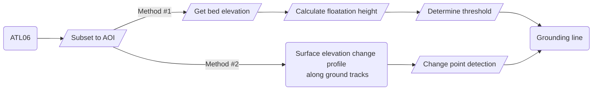

# Groundingline-Greenland

## Gounding line/zone delineation using ICESat-2

This is a project of the [ICESat-2 track](https://icesat-2-2024.hackweek.io/intro.html) of the [UW Earth Sciences hackweek 2024](https://2024.hackweek.io/).

The project derives the grounding line position of Greenland's tidewater glaciers from the surface elevation measured by ICESat-2. The grounding line or grounding zone has been identified as an important feature related to the stability of tidewater glaciers. Its depth is a key parameter in modeling submarine melting. If the grounding line is above a retrograde bed, it can induce rapid retreat of the calving front. Previous studies have also shown that glaciers are more sensitive to grounding line migration than to changes in terminus position due to reductions in basal resistance. There are many other questions that need to be investigated, such as how grounding line migration might affect the drainage of subglacial channels.

During this hackweek we hope to achieve the following goals.

1. Become familiar with ICESat-2 datasets and geospatial data processing using Python.
2. Explore different methods to derive grounding lines from surface elevations.
3. Develop reproducible workflows and data visualization tools.

### Collaborators

| Name | Personal goals | Can help with | Role |
| ------------- | ------------- | ------------- | ------------- |
| Hui Gao | Testing ICESat-2's capability in deriving grounding line of Greenland tidewater glaciers | Geospatial data processing, method development, Github  | Project Lead |
| ... | ... | ... | ... |
| ... | ... | ... | ... |

### The problem

The grounding line or grounding zone is an important feature at the ice-ocean boundary. Most previous studies have focused on the Antarctic ice sheet, where large ice shelves exist. The Greenland Ice Sheet is drained by over 150 tidewater glaciers, most of which are less than 5 km wide near the terminus. Many of these glaciers terminate in a narrow fjord, and some form floating ice tongues. However, only a few datasets of the grounding lines of Greenland's tidewater glaciers are published, one of the publicly available datasets is this [CCI dataset](http://products.esa-icesheets-cci.org/products/downloadlist/GLL/) in northern Greenland. 

ICESat-2 measures surface elevation with high vertical accuracy and a small footprint. Its temporal and spatial sampling has been greatly improved compared to ICESat. However, the gaps between ground tracks and the current temporal resolution of repeated ground tracks may still not be ideal for our purpose. In addition, we can expect challenges due to tidal correction, firn correction, and uncertainty in bedrock topography.

Overall, we will test the ability of ICESat-2 to derive grounding line positions of Greenland's tidewater glaciers. Starting with data access and visualization, we will explore different methods to derive grounding lines from surface elevation. A starting point is the use of floatation height and Archimedes' principle. A demo can be found [here]().
## Data and Methods

### Data

**Key datasets**

1. **Surface elevation**: [ICESat-2 ATL06](https://nsidc.org/data/atl06/versions/6), [ICESat ATL03](https://nsidc.org/data/atl03/versions/6)
2. **Bedrock topography**: [BedMachine Greenland, Version 5](https://nsidc.org/data/idbmg4/versions/5)

**Ancillary datasets**
1. **Terminus position**: [MEaSUREs Annual Greenland Outlet Glacier Terminus Positions from SAR Mosaics, Version 2](https://nsidc.org/data/nsidc-0642/versions/2), or [TermPicks](https://doi.org/10.5281/zenodo.6557981)
2. **Satellite images**: Sentinel2 (accessed through Google Earth Engine Python API)
3. **Glacier flow lines**: [Felikson et al. (2020)](https://doi.org/10.1029/2020GL090112) (Data is available on [Zenodo](https://doi.org/10.5281/zenodo.4284759))
4. **Validation grounding line datasets**: [Ciracì et al. (2023)](https://doi.org/10.1073/pnas.2220924120) (Data is available on [Dryad](https://doi.org/10.7280/D1XT4G))

### Proposed methods/tools

We will test at least the following two different methods.

1. Calculate the floatation height using Archimedes' principle and determine whether the ice is grounded by comparing it with the surface elevation from ICESat-2.
2. Using the surface elevation profile to find the "inflexion point", e.g. [Fricker and Padman et al. (2006)](https://doi.org/10.1029/2006GL026907) and [Brunt et al. (2010)](https://doi.org/10.3189/172756410791392790)

Here is a flowchart:

### Additional resources or background reading

**What is a ground line or grounding zone?
1. quote
2. quote

**ICESat-2
1. Citation 2017 paper
2. Link to NSIDC Data Portal
3. Data access packages: icepyx, SlideRule

**Python Libraries for Geospatial Data Processing
1. gdal
2. geopandas
4. shapely
5. rasterio
7. pyproj for projection transformation
8. xarray

**Other useful tools
1. **Version control: Github and git
2. **Workflow Management System: Snakemake
3. **Interactive data display: dash, streamlit

## Project goals and tasks

### Project goals

List the specific project goals or research questions you want to answer. Think about what outcomes or deliverables you'd like to create (e.g. a series of tutorial notebooks demonstrating how to work with a dataset, results of an anaysis to answer a science question, an example of applying a new analysis method, or a new python package).

* Goal 1
* Goal 2
* ...

### Tasks

What are the individual tasks or steps that need to be taken to achieve each of the project goals identified above? What are the skills that participants will need or will learn and practice to complete each of these tasks? Think about which tasks are dependent on prior tasks, or which tasks can be performed in parallel.

* Task 1 (all team members will learn to use GitHub)
* Task 2 (team members will use the scikit-learn python library)
  * Task 2a (assigned to team member A)
  * Task 2b (assigned to team member B)
* Task 3
* ...

## Files and folders in your project repository

This template provides the following suggested organizaiton structure for the project repository, but each project team is free to organize their repository as they see fit.

* **`contributors/`**
  Each team member can create their own folder under contributors, within which they can work on their own scripts, notebooks, and other files. Having a dedicated folder for each person helps to prevent conflicts when merging with the main branch. This is a good place for team members to start off exploring data and methods for the project.
* **`notebooks/`**
  Notebooks that are considered delivered results for the project should go in here.
* **`scripts/`**
  Code that is shared by the team should go in here (e.g. functions or subroutines). These will be files other than Jupyter Notebooks such as Python scripts (.py).
* `.gitignore`
  This file sets the files that will be globally ignored by `git` for the project. (e.g. you may want git to ignore temporary files or large data files, [read more about ignoring files here](https://docs.github.com/en/get-started/getting-started-with-git/ignoring-files))
* `environment.yml`
  `conda` environment description needed to run this project.
* `README.md`
  Description of the project (see suggested headings below)
* `model-card.md`
  Description (following a metadata standard) of any machine learning models used in the project

## Project Results

Use this section to briefly summarize your project results. This could take the form of describing the progress your team made to answering a research question, developing a tool or tutorial, interesting things found in exploring a new dataset, lessons learned for applying a new method, personal accomplishments of each team member, or anything else the team wants to share.

You could include figures or images here, links to notebooks or code elsewhere in the repository (such as in the [notebooks](notebooks/) folder), and information on how others can run your notebooks or code.
