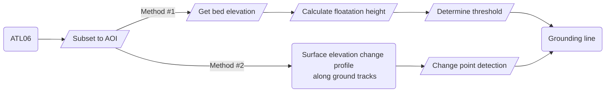
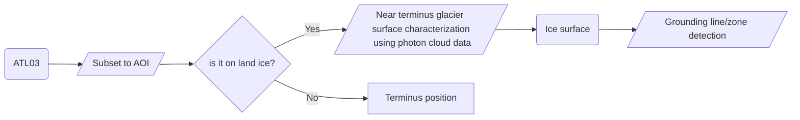

# GroundingLine-Greenland

## Gounding line/zone delineation using ICESat-2

This is a project of the [ICESat-2 track](https://icesat-2-2024.hackweek.io/intro.html) of the [UW Earth Sciences hackweek 2024](https://2024.hackweek.io/).

The project derives the grounding line position of Greenland's tidewater glaciers from the surface elevation measured by ICESat-2. The grounding line or grounding zone has been identified as an important feature related to the stability of tidewater glaciers. Its depth is a key parameter in modeling submarine melting. If the grounding line is on a retrograde bed, it can induce rapid retreat of the calving front. Previous studies have also shown that glaciers are more sensitive to grounding line migration than to changes in terminus position due to reductions in basal resistivity. There are many other questions that need to be investigated, such as how grounding line migration might affect the drainage of subglacial channels.

During this hackweek we hope to accomplish the following broad goals. Team members are welcome to define their own goals and combine them with our project.

1. Become familiar with ICESat-2 datasets and geospatial data processing using Python.
2. Explore different methods for deriving grounding lines from surface elevation measurements, and the challenges and uncertainties involved.
3. Develop reproducible workflows and data visualization tools.

### Collaborators

| Name | Personal goals | Can help with | Role |
| ------------- | ------------- | ------------- | ------------- |
| Hui Gao | Testing the ability of ICESat-2 to derive the grounding line of Greenland tidewater glaciers | Geospatial data processing, method development, Github  | Project Lead |
| ... | ... | ... | ... |
| ... | ... | ... | ... |

### The problem

The grounding line or grounding zone is an important feature at the ice-ocean boundary. Most previous studies have focused on the Antarctic Ice Sheet, where large ice shelves exist. The Greenland Ice Sheet is drained by over 150 tidewater glaciers, most of which are less than 5 km wide near the terminus. Many of these glaciers terminate in a narrow fjord, and some form floating ice tongues. However, only a few datasets of the grounding lines of Greenland's tidewater glaciers are published, one of the publicly available datasets is this [CCI dataset](http://products.esa-icesheets-cci.org/products/downloadlist/GLL/) in northern Greenland. 

ICESat-2 measures surface elevation with high vertical accuracy and a small footprint. Its temporal and spatial sampling has been greatly improved compared to ICESat. However, the gaps between ground tracks and the current temporal resolution of repeated ground tracks may still not be ideal for our purpose. In addition, we can expect challenges due to tidal correction, firn correction, and uncertainty in bedrock topography.

Overall, we will test the ability of ICESat-2 to derive grounding line positions of Greenland's tidewater glaciers. Starting with data access and visualization, we will explore different methods to derive grounding lines from surface elevation. A starting point is the use of floatation height and Archimedes' principle. A demo can be found [here](https://github.com/hui-97/Test-project/blob/main/demos/Demo_petermann.ipynb).
## Data and Methods

### Data

**Key datasets**

1. **Surface elevation**: [ICESat-2 ATL06](https://nsidc.org/data/atl06/versions/6), [ICESat ATL03](https://nsidc.org/data/atl03/versions/6)
2. **Bedrock topography**: [BedMachine Greenland, Version 5](https://nsidc.org/data/idbmg4/versions/5)

**Ancillary datasets**
1. **Terminus position**: [MEaSUREs Annual Greenland Outlet Glacier Terminus Positions from SAR Mosaics, Version 2](https://nsidc.org/data/nsidc-0642/versions/2), or [TermPicks](https://doi.org/10.5281/zenodo.6557981)
2. **Satellite images**: Sentinel2 (accessed through Google Earth Engine Python API)
3. **Glacier flowlines**: [Felikson et al. (2020)](https://doi.org/10.1029/2020GL090112) (Data is available on [Zenodo](https://doi.org/10.5281/zenodo.4284759))
4. **Validation grounding line datasets**: [Ciracì et al. (2023)](https://doi.org/10.1073/pnas.2220924120) (Data is available on [Dryad](https://doi.org/10.7280/D1XT4G))

### Proposed methods/tools

We will test at least the following two different methods.

1. Calculate the floatation height using Archimedes' principle and determine whether the ice is grounded by comparing it with the surface elevation from ICESat-2.
2. Use the surface elevation profile to find the "inflexion point" ("I" in the figure below), e.g. [Fricker and Padman et al. (2006)](https://doi.org/10.1029/2006GL026907) and [Brunt et al. (2010)](https://doi.org/10.3189/172756410791392790). This method does not require bed topography which has its own uncertainty.

Note that tidal movement or sea level changes can add challenges to the above methods. And none of them is a direct measurement of the grounding line, but rather a proxy for the grounding line. Here is a flowchart of the proposed methods:

> [!NOTE]
> In addition, team members are encouraged to explore beyond the method suggested above. Here are three examples.

**Example 1**: Use ATL03 instead of ATL06 to study glacier geometry near the ice-ocean boundary. ATL03 is the geolocated photon cloud dataset that preserves information such as crevasses near the glacier terminus where they exist. You can start with the *signal_conf_ph* classification (land, ocean, sea ice, land ice, inland water) with specific confidence levels from 0 (likely background) to 4 (high confidence signal), then play with different data filtering methods to determine the ice surface and test if it's a better dataset for finding the grounding zone. Here is a simple example flowchart:

**Example 2**: Data visualization is more than just visualizing data. It helps us understand the information behind the dataset in an effective and engaging way. Tools like *[dash](https://dash.plotly.com/)* or *[streamlit](https://streamlit.io/)* help to create interactive dashboards or web applications. Objectives of trying these tools can be:

1. Visualize 3D or 4D data without user coding, such as displaying maps, surface elevation profiles, or time series at a user-selected date or location.
2. Display statistics. For example, how many glaciers on the Greenland Ice Sheet have a floating ice tongue, meaning the grounding line is upstream of the glacier terminus, and where they are located?

**Example 3**: Test the use of DEMs to derive the grounding line and compare with ICESat-2 results. If ICESat-2 ground tracks are nearly perpendicular to the glacier flow direction, gaps between different ground tracks would make it difficult to determine the position of the grounding line. DEMs such as time-dependent strips from [ArcticDEM](https://www.pgc.umn.edu/data/arcticdem/) have the potential to resolve the full grounding line in the fast-flowing region of tidewater glaciers. However, they have varying degrees of uncertainty in their vertical accuracy. Sometimes the error can be as large as a few meters. If you are interested in looking into this, even just comparing these different DEMs with the ICESat-2 surface elevation would be a great exercise.

### Additional resources or background reading

**What is a ground line or grounding zone?**
1. Tidewater glaciers are marine-terminating outlet glaciers, where the glacier flows into the ocean with its bedrock at the terminus below sea level.
2. Grounding line is the boundary between grounded ice and the adjoining floating ice shelf or ice tongue ([Weertman et al., 1974](https://doi.org/10.3189/S0022143000023327)). Here is also a more recent review of "Remote sensing of glacier and ice sheet grounding lines" by [Friedl et al. (2020)](https://doi.org/10.1016/j.earscirev.2019.102948)
3. "The grounding line is located within the grounding zone, which represents the transition from fully grounded ice to freely floating ice. In the grounding zone, ice flexure occurs mainly due to short-term sea level variations. Hence, the grounding zone is sometimes also called "flexure zone". " by Friedl et al. (2020).

**About ICESat-2**
1. Description of the ICESat-2 satellite mission design from [Markus et al. (2017)](https://doi.org/10.1016/j.rse.2016.12.029)
2. ATL03 L2A Global Geolocated Photon data product details: [Neumann et al. (2019)](https://doi.org/10.1016/j.rse.2019.111325)
3. ATL06 L3A Land Ice Height data product details: [Smith et al. (2019)](https://doi.org/10.1016/j.rse.2019.111352)
4. ICESat-2 data are available at [NSIDC](https://nsidc.org/data/icesat-2/data)
5. Python packages to obtain ICESat-2 data: [icepyx](https://icepyx.readthedocs.io/en/latest/), [SlideRule](https://slideruleearth.io/)

**Python libraries for geospatial data processing**
1. [gdal](https://gdal.org/api/index.html#python-api) for general geospatial data processing.
2. [GeoPandas](https://geopandas.org/en/stable/index.html) has *GeoDataFrame* which works well with vector data.
4. [Shapely](https://shapely.readthedocs.io/en/stable/) has great functions for working with vector data, such as creating and manipulating points, lines, and polygons.
5. [Rasterio](https://rasterio.readthedocs.io/en/stable/) has all the basic functions to read and processing raster data.
7. [pyproj](https://pyproj4.github.io/pyproj/stable/) works great for projection transformations.
8. [Xarray](https://docs.xarray.dev/en/stable/) works great with labelled multidimensional arrays or datasets, such as netCDF files.
9. [netCDF4](https://unidata.github.io/netcdf4-python/) is used to handle netCDF files in Python.
10. [h5py](https://docs.h5py.org/en/stable/) is used to handle HDF5 binary data format, which is used by the ICESat-2 ATL03 and ATL06 datasets.
11. [ee](https://developers.google.com/earth-engine/tutorials/community/intro-to-python-api) is the Google Earth Engine Python API, which can be used to visualize and analyze various remote sensing datasets in the cloud.

**Other useful tools**
1. Version control: Github and git
2. Workflow management system: [Snakemake](https://snakemake.github.io/) (Python-based workflow management system to create reproducible and scalable data analyses)
3. Interactive data apps: [dash](https://dash.plotly.com/), [streamlit](https://streamlit.io/)

## Files and folders in your project repository

* **`assets/`**
  Images or custom CSS files are stored here.
* **`contributors/`**
  Each team member can create their own folder under contributors, within which they can work on their own scripts, notebooks, and other files. Having a dedicated folder for each person helps to prevent conflicts when merging with the main branch. This is a good place for team members to start off exploring data and methods for the project.
* **`notebooks/`**
  Notebooks that are considered delivered results for the project should go in here.
* **`scripts/`**
  Code that is shared by the team should go in here (e.g. functions or subroutines). These will be files other than Jupyter Notebooks such as Python scripts (.py).
* `.gitignore`
  This file sets the files that will be globally ignored by `git` for the project. (e.g. you may want git to ignore temporary files or large data files, [read more about ignoring files here](https://docs.github.com/en/get-started/getting-started-with-git/ignoring-files))
* `environment.yml`
  `conda` environment description needed to run this project.
* `README.md`
  Description of the project (see suggested headings below)
* `model-card.md`
  Description (following a metadata standard) of any machine learning models used in the project

## Project Results

Use this section to briefly summarize your project results. This could take the form of describing the progress your team made to answering a research question, developing a tool or tutorial, interesting things found in exploring a new dataset, lessons learned for applying a new method, personal accomplishments of each team member, or anything else the team wants to share.

You could include figures or images here, links to notebooks or code elsewhere in the repository (such as in the [notebooks](notebooks/) folder), and information on how others can run your notebooks or code.
